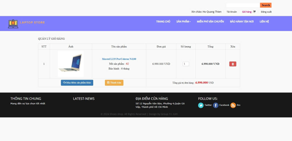
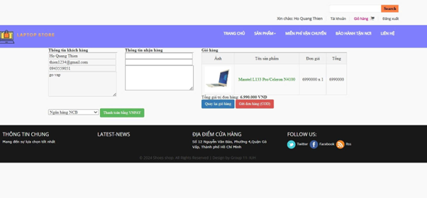
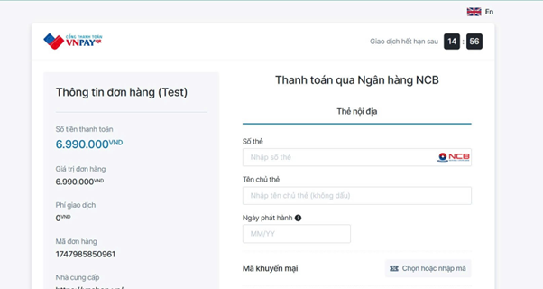
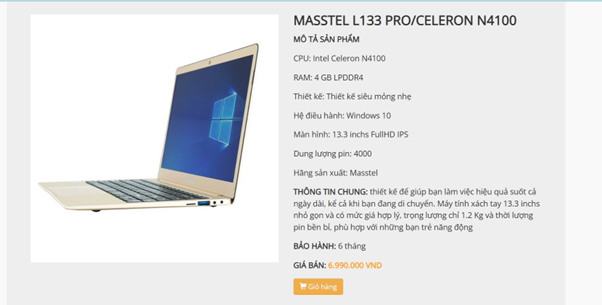
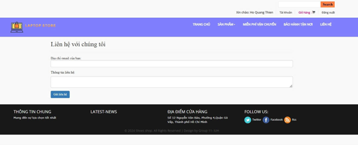
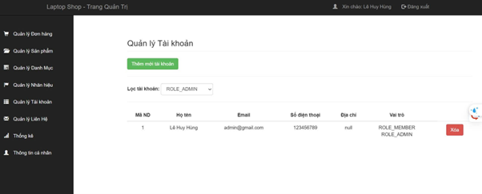
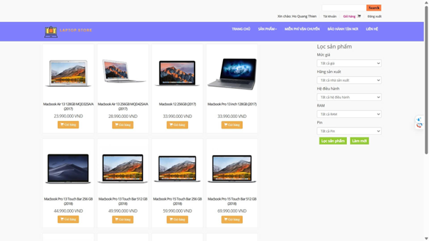
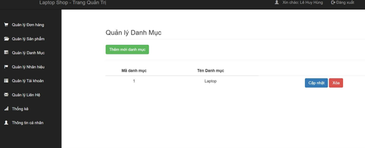
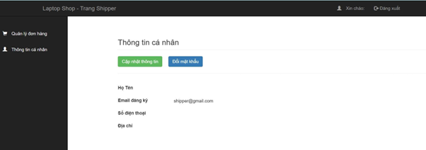
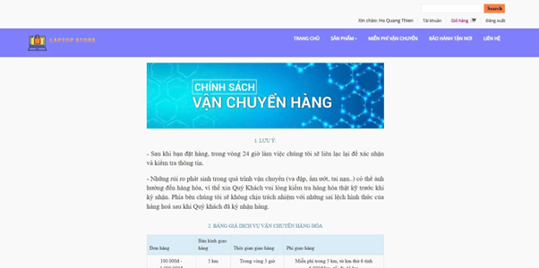

# 💻 LapTopStore - Website Bán Laptop

**LapTopStore** là một website thương mại điện tử chuyên bán laptop, cung cấp trải nghiệm người dùng mượt mà với các tính năng đầy đủ từ đặt hàng đến quản lý hệ thống dành cho admin.

---

## 🚀 Tính năng nổi bật

- 🔐 Đăng ký / Đăng nhập / Quản lý tài khoản
- 🛒 Giỏ hàng, thanh toán, xem chi tiết sản phẩm
- 📦 Quản lý đơn hàng, sản phẩm, người dùng (Admin)
- 📈 Trang thống kê (Admin)
- 🤖 Tích hợp Chatbot AI hỗ trợ người dùng
- ⚙️ Chính sách bảo hành, giao hàng rõ ràng

---

## 🖼️ Giao diện Demo

| Giao diện                         | Hình ảnh                                               |
|----------------------------------|--------------------------------------------------------|
| 🔐 Đăng nhập                     |                 |
| 📝 Đăng ký                       |              |
| 🏠 Trang chủ                     |                  |
| 🛒 Giỏ hàng                      |                  |
| 💳 Thông tin thanh toán          |          |
| 💳 Xác nhận thanh toán           |              |
| 📦 Chi tiết sản phẩm             |         |
| 🔧 Chính sách bảo hành           |             |
| ✉️ Liên hệ                       |               |
| 👤 Quản lý người dùng (Admin)    |          |
| 🛍️ Quản lý sản phẩm             |               |
| 📦 Quản lý đơn hàng              |       |
| 📁 Danh mục & Thương hiệu        |  |
| 📊 Trang thống kê                |              |
| 🚚 Thông tin Shipper             |          |
| 📦 Chính sách vận chuyển         |        |
| 🤖 Chatbot AI hỗ trợ             |                    |

---

## ⚙️ Cài đặt và chạy dự án

### 1. Clone project

- git clone https://github.com/HoGiaKham/LapTopStore.git
- cd LapTopStore
- npm install simple-peer
### 2. SQL Workbench
- New MySQL Connection
- Nhập password: 123456
- copy và dán file laptopshop.sql
- run
- Open intelj, run (at main class) 

## 🛠️ Công nghệ sử dụng

| Công nghệ | Mô tả |
|----------|-------|
| 🎨 **Frontend** | ReactJS, TailwindCSS |
| 🔧 **Backend** | Node.js, ExpressJS |
| 🗃️ **Database** | MySQL (qua MySQL Workbench) |
| 🔐 **Xác thực** | JWT (JSON Web Token) |

---

