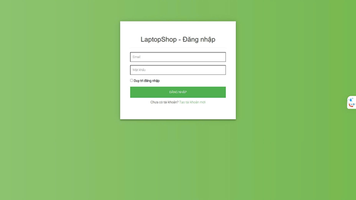
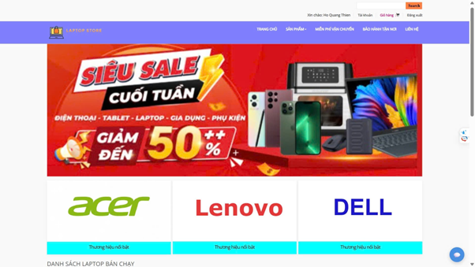
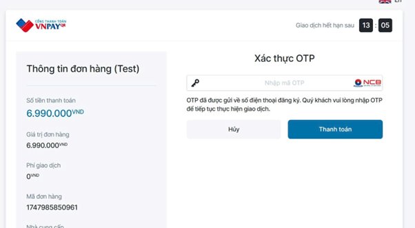
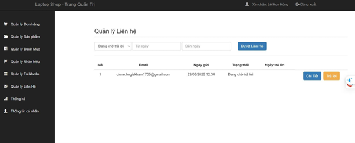
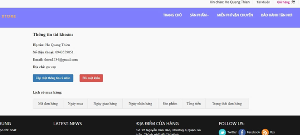
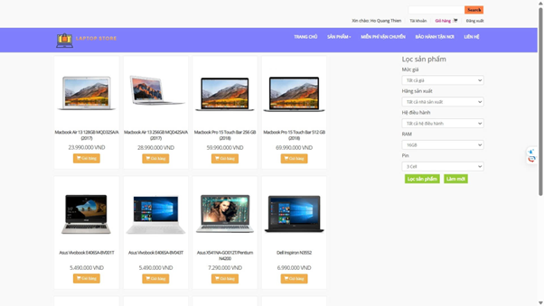
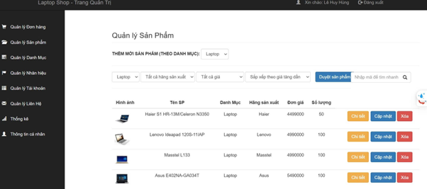
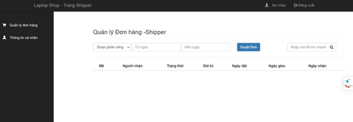
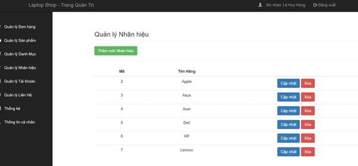

# 💻 LapTopStore - Web Bán Laptop

**LapTopStore** là một website bán laptop với giao diện trực quan, đầy đủ các chức năng từ đăng ký, đăng nhập, xem sản phẩm, giỏ hàng, thanh toán, đến quản lý đơn hàng dành cho admin.

---

## 🚀 Tính năng chính

- 🧑‍💻 Đăng ký / Đăng nhập / Quản lý tài khoản
- 🛒 Quản lý sản phẩm, giỏ hàng, thanh toán
- 🛍️ Chi tiết sản phẩm, chính sách bảo hành, giao hàng
- 📦 Trang Admin: Quản lý người dùng, đơn hàng, sản phẩm, thống kê
- 🤖 Chatbot AI hỗ trợ

---

## 🖼️ Giao diện Demo

### 🔐 Màn hình Đăng nhập

### 📝 Màn hình Đăng ký

### 🏠 Màn hình chính

### 🛒 Trang giỏ hàng

### 📄 Thông tin thanh toán
  
  

### 📦 Chi tiết sản phẩm

### 🔧 Chính sách bảo hành

### ✉️ Liên hệ
  

### 👤 Quản lý người dùng
  

### 📦 Quản lý sản phẩm
  
  

### 📦 Quản lý đơn hàng
  

### 🗂️ Quản lý danh mục & thương hiệu
  

### 📊 Thống kê (Admin)

### 🚚 Thông tin Shipper

### 📦 Chính sách vận chuyển

### 🤖 Chatbot AI hỗ trợ

---

## 🛠️ Công nghệ sử dụng

- **Frontend**: ReactJS, TailwindCSS
- **Backend**: Node.js, ExpressJS
- **Cơ sở dữ liệu**: MongoDB hoặc MySQL
- **Xác thực**: JWT (JSON Web Token)

---

## 🏁 Hướng dẫn chạy project (local)

### 📦 1. Clone repo

- git clone https://github.com/HoGiaKham/LapTopStore
- cd LapTopStore

⚙️ 2. Cài đặt và chạy Frontend
- cd laptopstore-frontend
- npm install
- npm start

⚙️ 3. Cài đặt và chạy Backend
- cd ../laptopstore-backend
- npm install
- npm run dev

### Cổng: http://localhost:5000

📫 Liên hệ
### Email: kham@example.com
### GitHub: github.com/HoGiaKham
